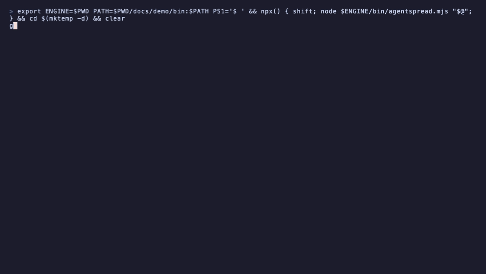

<h1 align="center">agentspread</h1>

<p align="center">
  <a href="https://github.com/sulhadin/agentspread/actions/workflows/ci.yml"></a>
  <a href="https://github.com/sulhadin/agentspread/releases"></a>
  <a href="https://github.com/dyoshikawa/rulesync"></a>
</p>

<p align="center">
<b>Write your AI agent instructions, skills, subagents, commands and hooks once. Every repo gets them as a PR.</b><br>
Claude Code · Codex · Cursor · Antigravity · Copilot · OpenCode · and more
</p>

---

Teams copy the same agent config into every repo, and the copies drift. agentspread keeps it in **one repo**, split into groups (org-wide, per platform, per repo). Merge conventional-commit PRs, press *Run workflow*, and each consumer repo gets a pull request with exactly its groups, generated for every AI tool it uses. Versions, tags and `CHANGELOG.md` are computed for you.

```
 <org>/agentspread-config (content repo)     each consumer repo
 ───────────────────────────────────────     ──────────────────
 groups/common/  ─┐                          PR "chore(agentspread): update shared AI agent config to v1.2.0"
 groups/backend/ ─┼─ release v1.2.0 ──────▶    .agentspread/      its groups, copied at v1.2.0
 groups/web/     ─┘                            .claude/           skills, agents, commands, hooks for Claude Code
                                               .agents/skills/    skills for Codex, Cursor, Antigravity, Copilot, OpenCode
                                               .codex/            agents, hooks for Codex
                                               AGENTS.md          a shared section of instructions; the rest stays the repo's
                                               CLAUDE.md          the same section, only if the repo has one
```

agentspread is the engine: an npm package (`npx agentspread …`) plus reusable GitHub workflows. Your **content repo** holds only your groups and three small workflow files that call agentspread at a pinned version, and Dependabot opens a PR when a new agentspread version is out. Sync copies each release into the consumer's committed `.agentspread/`, and [rulesync](https://github.com/dyoshikawa/rulesync) generates each tool's files from it. Everything is committed, so every clone and cloud agent session sees it without a build step or a token.

## Get started

You need `gh` (logged in), Node 22+, and admin rights on the org. The full walkthrough is in [docs/setup.md](docs/setup.md).

1. **Create the content repo:**
   ```bash
   gh repo create <org>/agentspread-config --private --clone
   cd agentspread-config
   npx agentspread init
   ```
   
2. **Add your content** under `groups/`: see [Writing groups](docs/groups.md).
3. **Create the GitHub App** that opens the PRs: see [The GitHub App](docs/github-app.md).
4. **Release:** commit with a `feat:` message, then run the **release** workflow in the content repo's Actions tab. See [Releasing](docs/releasing.md).
5. **Onboard repos:** in the content repo, run `npm install` and then `npm run onboard`. Pick the repos, the agents they use and their groups, then merge the adoption PR each repo gets. See [Consumer repos](docs/consumer-repos.md).

   

## Day to day

### Change something

Open a PR in the content repo with a conventional title (`feat(groups): add api-design`, `fix: ...`) and squash-merge it. The title decides the next version; see [Releasing](docs/releasing.md#how-the-version-is-chosen).

### Release

1. In the content repo on GitHub, open the **Actions** tab.
2. Pick the **release** workflow on the left and click **Run workflow** (branch `main`).

Or from a terminal: `gh workflow run agentspread-release.yml`.

The workflow computes the next version from the commits since the last tag, updates `CHANGELOG.md`, tags the release, and opens or updates a `chore/agentspread-sync` PR in every consumer repo whose content changed. If there is nothing to release, it stops with a notice. Details in [Releasing](docs/releasing.md).

### Change a repo's groups or agents

1. In the content repo, run `npm run reconfigure`.
2. Pick the repo from the list of adopted ones.
3. Tick the agents the repo should have files for (space toggles, enter confirms). Its current agents are already ticked.
4. Tick its groups the same way. `common` and the group named after the repo are always included. This step is skipped when the content repo has no other groups.
5. Check the summary and answer **Open the PR?**.


The PR keeps the repo on its current release and only regenerates its files for the new selection.

Without prompts: `npx agentspread reconfigure web --groups backend --targets claudecode,codexcli`. Each flag replaces the whole list; `common` and the repo's own group are always kept.

### Sync by hand

To roll an existing release out again, to one repo or to all, without cutting a new release, see [Manual sync](docs/manual-sync.md).

## Docs

| Page | What it covers |
|---|---|
| [Setup walkthrough](docs/setup.md) | First-time setup from an empty org to the first consumer PR, step by step |
| [Writing groups](docs/groups.md) | How to lay out instructions, skills, subagents, commands and hooks, and what the lint checks |
| [The GitHub App](docs/github-app.md) | Creating the bot that opens the PRs, storing its key and installing it |
| [Releasing](docs/releasing.md) | How versions are chosen, the first release, and cutting a release |
| [Manual sync](docs/manual-sync.md) | Rolling an existing release out again, to one repo or to all |
| [Consumer repos](docs/consumer-repos.md) | What a repo gets when it is onboarded, and the rules for living with it |
| [Security](docs/security.md) | What to review before a release, and how the workflows limit access |
| [Why agentspread over plain rulesync](docs/why-not-rulesync.md) | What agentspread adds on top of rulesync, and when rulesync alone is enough |
| [Developing agentspread](docs/development.md) | Working on this repo and publishing a new version |

## License

[MIT](LICENSE)
